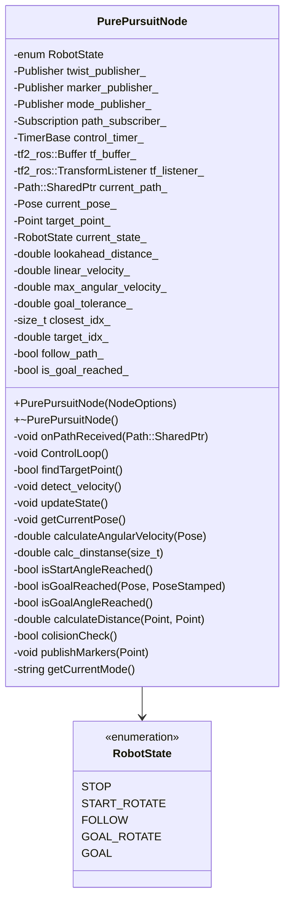
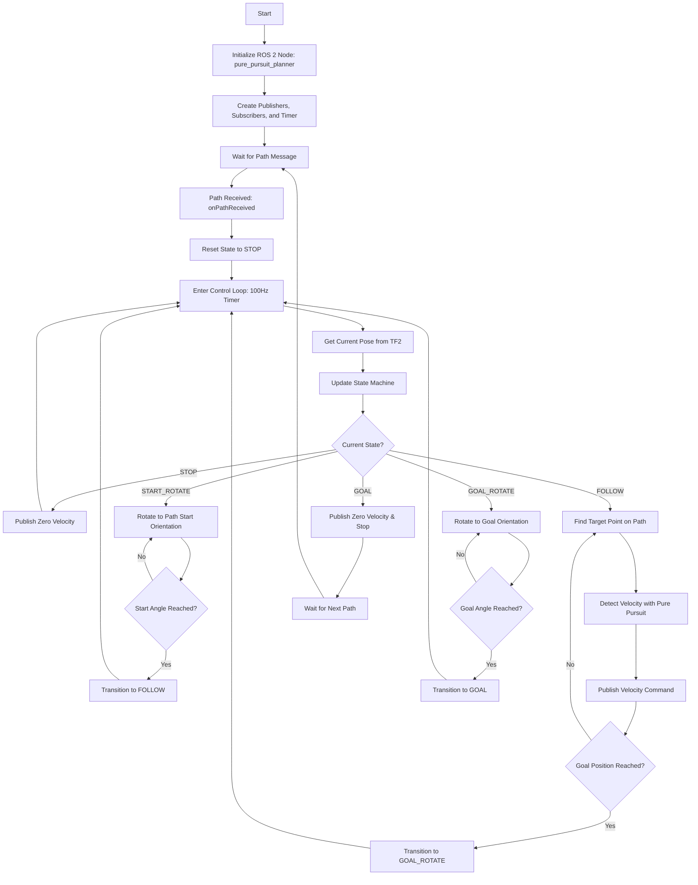
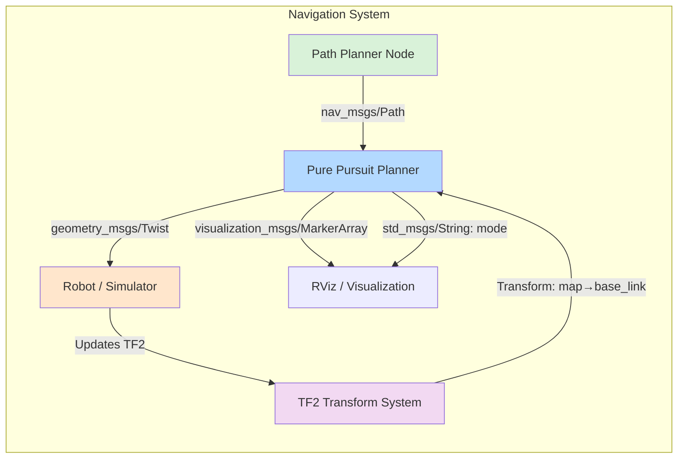

<p style="display: inline">
  <!-- Programming Language -->
  
  <!-- ROS 2 -->
  
  <!-- Geometry Messages -->
  
  <!-- Navigation Messages -->
  
  <!-- TF2 -->
  
</p>

## Functional Overview
This software implements a ROS 2 node for path following control of robots or autonomous vehicles using the Pure Pursuit algorithm. It calculates and outputs velocity and angular velocity commands to efficiently navigate the robot along a specified path.


## Requirements
### System Requirements
- OS : Ubuntu 22.04  
- ROS2 : Humble

### System Dependencies
- [path_smoother](https://github.com/Arcanain/path_smoother) 
- [arcanain_simulator](https://github.com/Arcanain/arcanain_simulator) 

## How To Use
### Execution Steps
```bash
cd ~/ros2_ws
source ~/ros2_ws/install/setup.bash
ros2 launch pure_pursuit_planner pure_pursuit_planner.py
```

### Folder Structure
```
pure_pursuit_planner/
├── include/                               - Directory for header files
│   └── pure_pursuit_planner/              - Header files for the pure_pursuit_planner package
│       └── pure_pursuit_planner_component.hpp - Header file for the Pure Pursuit planner component
├── launch/                                - Directory for ROS 2 launch files
│   └── pure_pursuit_planner.py            - Launch script for the pure_pursuit_planner node
├── rviz/                                  - Directory for RViz configuration files
│   └── pure_pursuit_planner.rviz          - RViz configuration file for the Pure Pursuit planner
├── src/                                   - Directory for source files
│   ├── pure_pursuit_planner_component.cpp - Implementation of the Pure Pursuit planner component
│   └── pure_pursuit_planner_node.cpp      - Node implementation for the Pure Pursuit planner
├── CMakeLists.txt                         - CMake build configuration file
└── package.xml                            - ROS 2 package metadata file
```

## Interface Table

### Input

| Variable Name      | Type            | Description                         |
|-------------------------|-------------------|---------------------------------------|
| `path`                  | `nav_msgs::msg::Path` | Target trajectory for the robot to follow |
| Transform (TF2)         | `geometry_msgs::msg::TransformStamped` | Robot pose via TF2 (map → base_link) |

### Output

| Variable Name      | Type            | Description                         |
|-------------------------|-------------------|---------------------------------------|
| `/auto_cmd_vel`         | `geometry_msgs::msg::Twist` | Velocity commands for the robot |
| `~/marker`              | `visualization_msgs::msg::MarkerArray` | Visualization markers for target point |
| `~/mode`                | `std_msgs::msg::String` | Current robot state (STOP/START_ROTATE/FOLLOW/GOAL_ROTATE/GOAL) |

### Parameters

| Parameter Name         | Type     | Default | Description                         |
|------------------------|----------|---------|-------------------------------------|
| `lookahead_distance`   | `double` | 0.5     | Base lookahead distance (m) |
| `min_lookahead_distance` | `double` | 0.3   | Minimum lookahead distance (m) |
| `max_lookahead_distance` | `double` | 1.5   | Maximum lookahead distance (m) |
| `linear_velocity`      | `double` | 0.2     | Target linear velocity (m/s) |
| `max_angular_velocity` | `double` | 1.0     | Maximum angular velocity (rad/s) |
| `goal_tolerance`       | `double` | 0.2     | Goal position tolerance (m) |
| `rotation_threshold`   | `double` | 0.1     | Rotation angle threshold (rad) |
| `rotation_velocity`    | `double` | 0.5     | Angular velocity for in-place rotation (rad/s) |
| `max_velocity`         | `double` | 1.0     | Maximum velocity limit (m/s) |
| `robot_frame_id`       | `string` | "base_link" | Robot frame ID for TF2 |
| `map_frame_id`         | `string` | "map"   | Map frame ID for TF2 |

### Internal Values

| Variable Name      | Type            | Description                         |
|-------------------------|-------------------|---------------------------------------|
| `current_pose_`         | `geometry_msgs::msg::Pose` | Current robot pose from TF2 |
| `target_point_`         | `geometry_msgs::msg::Point` | Current target point on path |
| `current_state_`        | `RobotState` | Current state (STOP/START_ROTATE/FOLLOW/GOAL_ROTATE/GOAL) |
| `closest_idx_`          | `size_t` | Index of closest point on path |
| `target_idx_`           | `double` | Index of current target point |
| `follow_path_`          | `bool` | Flag indicating if path following is active |
| `is_goal_reached_`      | `bool` | Flag indicating if goal has been reached |

## Software architecture

### Class Diagram



### Flowchart



## System Architecture



## Functional Requirements

| Feature                    | Requirement                                            | Reason                                                      | Specification                                                                                                                                                                | Implemented Functions                          |
|----------------------------|--------------------------------------------------------|-------------------------------------------------------------|------------------------------------------------------------------------------------------------------------------------------------------------------------------------------|----------------------------------------------|
| **State Machine Control** | The robot needs to manage different operational states during navigation. | To handle start rotation, path following, and goal rotation separately. | - Implement 5 states: STOP, START_ROTATE, FOLLOW, GOAL_ROTATE, GOAL<br>- Automatically transition between states based on conditions<br>(Implemented in `updateState`) | `updateState`, `getCurrentMode` |
| **Path Following Control** | The robot needs to efficiently follow the specified path using Pure Pursuit. | To ensure smooth and accurate path tracking. | - Find closest point on path using projection-based algorithm<br>- Select target point at lookahead distance ahead<br>- Calculate angular velocity using Pure Pursuit formula: ω = 2v·sin(α)/Lf<br>(Implemented in `findTargetPoint`, `detect_velocity`) | `findTargetPoint`, `detect_velocity` |
| **Smooth Goal Approach** | The robot needs to smoothly transition to goal orientation near the endpoint. | To prevent sudden turning motions near the goal. | - Gradually blend path tracking angle with goal orientation<br>- Use quadratic weight function based on distance (0-1.5m)<br>- Weight increases smoothly as robot approaches goal<br>(Implemented in `detect_velocity`) | `detect_velocity` |
| **Pose Estimation via TF2** | The robot needs to obtain its current pose from TF2. | To maintain accurate localization without direct odometry subscription. | - Query TF2 for transform from map to base_link<br>- Extract position and orientation from transform<br>(Implemented in `getCurrentPose`) | `getCurrentPose` |
| **Orientation Control** | The robot needs to rotate to path start and goal orientations. | To align properly before following path and after reaching goal. | - Calculate angular velocity based on angle difference<br>- Use threshold (0.1 rad) to determine when rotation is complete<br>(Implemented in `calculateAngularVelocity`, `isStartAngleReached`, `isGoalAngleReached`) | `calculateAngularVelocity`, `isStartAngleReached`, `isGoalAngleReached` |
| **Visualization** | The system needs to publish markers for debugging and monitoring. | To visualize target point and current state in RViz. | - Publish sphere marker at target point<br>- Publish current state as string message<br>(Implemented in `publishMarkers`, `getCurrentMode`) | `publishMarkers`, `getCurrentMode` |

## Detailed Design

| Method Name           | Purpose                                           | Process                                                                                                                                    |
|-----------------------|---------------------------------------------------|---------------------------------------------------------------------------------------------------------------------------------------------|
| `ControlLoop`         | Main control loop executed at 100Hz               | 1. Get current pose from TF2 using `getCurrentPose()`<br>2. Check for collisions with `colisionCheck()`<br>3. Update state machine with `updateState()`<br>4. Execute state-specific control logic<br>5. Publish mode string |
| `updateState`         | Update robot state based on current conditions    | 1. Check current state<br>2. Evaluate transition conditions (angle reached, goal reached, etc.)<br>3. Transition to next appropriate state |
| `getCurrentPose`      | Get robot pose from TF2 transform                | 1. Query TF2 buffer for map→base_link transform<br>2. Extract position and orientation<br>3. Update `current_pose_` member variable |
| `findTargetPoint`     | Find closest point and target point on path      | 1. Search for closest point on path using projection algorithm<br>2. Update `closest_idx_`<br>3. Find point at lookahead distance ahead<br>4. Set `target_point_` and `target_idx_` |
| `detect_velocity`     | Calculate and publish velocity using Pure Pursuit | 1. Scale linear velocity based on lookahead distance<br>2. Calculate angle to target point<br>3. Apply smooth goal orientation blending near endpoint<br>4. Calculate angular velocity: ω = 2v·sin(α)/Lf<br>5. Clamp and publish Twist message |
| `calculateAngularVelocity` | Calculate angular velocity for rotation states | 1. Calculate angle difference to target orientation<br>2. Normalize by π/2 to get factor<br>3. Scale to angular velocity with min/max limits<br>4. Return signed velocity |
| `isStartAngleReached` | Check if aligned with path start orientation     | 1. Get start pose yaw from path<br>2. Calculate angle difference<br>3. Return true if difference < rotation_threshold |
| `isGoalReached`       | Check if position goal is reached                | 1. Calculate distance to goal position<br>2. Return true if distance < goal_tolerance |
| `isGoalAngleReached`  | Check if aligned with goal orientation           | 1. Get goal pose yaw from path<br>2. Calculate angle difference<br>3. Return true if difference < rotation_threshold |
| `calc_dinstanse`      | Calculate distance from robot to path segment    | 1. Project robot position onto path segment<br>2. Clamp projection parameter to [0,1]<br>3. Calculate Euclidean distance to projected point |
| `calculateDistance`   | Calculate Euclidean distance between two points  | 1. Compute dx and dy<br>2. Return √(dx² + dy²) |
| `publishMarkers`      | Publish visualization markers for RViz           | 1. Create sphere marker at target point<br>2. Set marker properties (color, scale)<br>3. Publish MarkerArray message |
| `onPathReceived`      | Callback for receiving new path                  | 1. Store path in `current_path_`<br>2. Set `follow_path_` to true<br>3. Reset `closest_idx_` to 0<br>4. Reset state to STOP |
